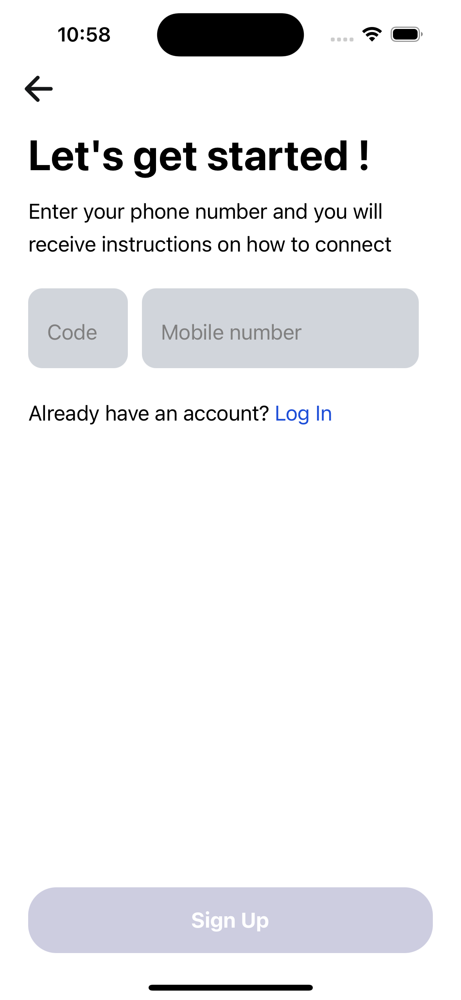
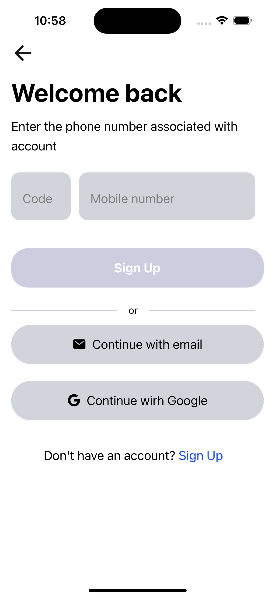
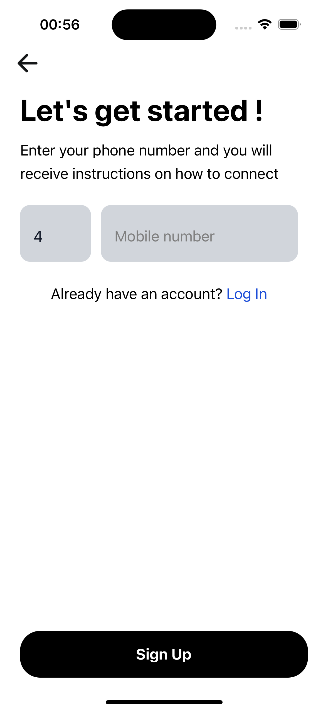
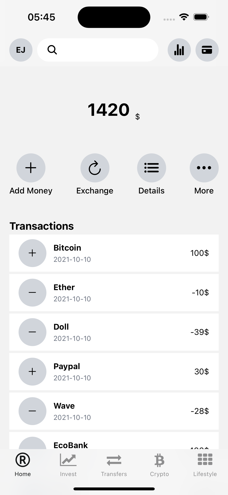
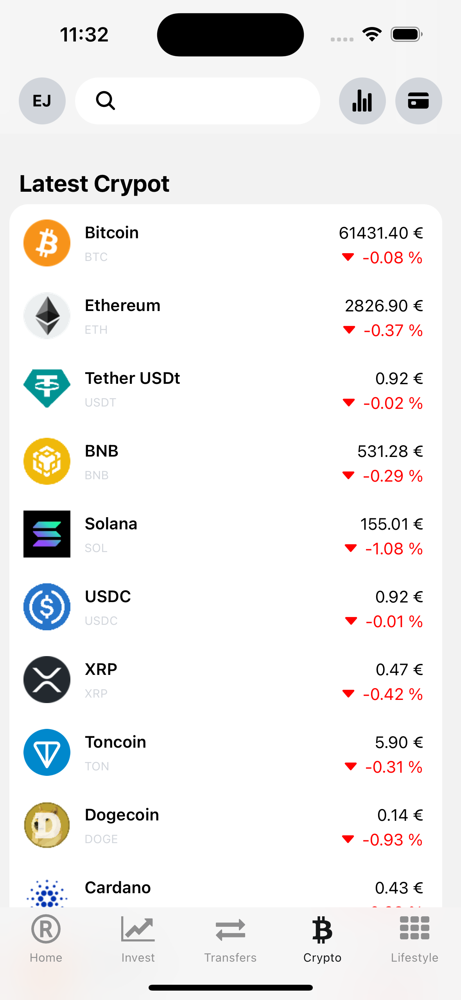
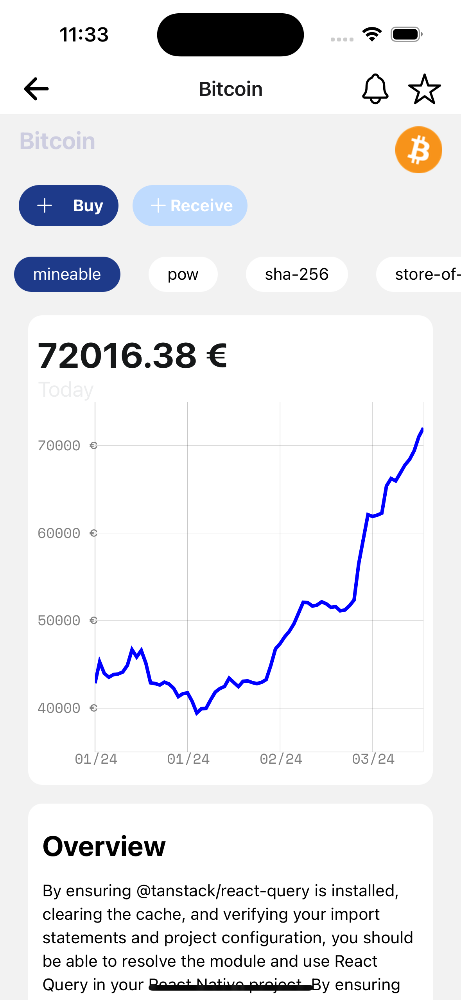

# FinTech Clone App

## Overview
This React Native Expo app is a FinTech clone designed to provide users with financial services such as banking, investing, and budgeting functionalities. The app utilizes modern technologies to offer a seamless user experience across both iOS and Android platforms.

## Screenshots

<div style="display: flex; flex-direction: 'row'; gap: 10px; flex-wrap: wrap" >
  
  
  
  
  
  
  
  
</div>

## Demo
<div style="display: flex; flex-direction: 'row';">


</div>

## Features
- **Banking Services**: Users can perform basic banking operations such as account management, transactions, and bill payments.
- **Investment**: Provides tools for users to track investments, analyze trends, and make informed decisions.
- **Budgeting Tools**: Offers budgeting features to help users manage their expenses, set financial goals, and track spending.
- **Security**: Implements robust security measures to ensure the safety of user data and transactions.
- **Customization**: Allows users to personalize their experience with customizable settings and preferences.

## Getting Started
To run the app locally, follow these steps:

1. **Clone the repository**:
   ```
   git clone https://github.com/essejacquesdansomon/react-native-fintech-clone.git as fintech
   ```

2. **Navigate to the project directory**:
   ```
   cd fintech-clone
   ```

3. **Install dependencies**:
   ```
   npm install
   ```

4. **Start the development server**:
   ```
   npm start
   ```
   This will launch the Expo development server.

5. **Scan QR Code**:
   Use the Expo Go app on your mobile device to scan the QR code displayed in the terminal or Expo Dev Tools. This will open the app on your device.


## Technologies Used
- **React Native**: Framework for building native mobile applications using JavaScript and React.
- **Expo**: A set of tools and services for building and deploying React Native apps.
- **Redux**: State management library for managing application state.
- **Firebase**: Backend services for authentication, database, and cloud functions.
- **React Navigation**: Routing and navigation library for React Native apps.

## Contributing
Contributions are welcome! If you'd like to contribute to this project, please follow these steps:
1. Fork the repository.
2. Create a new branch (`git checkout -b feature/your-feature`).
3. Make your changes.
4. Commit your changes (`git commit -m "Add new feature"`).
5. Push to the branch (`git push origin feature/your-feature`).
6. Create a pull request.

## License
This project is licensed under the [MIT License](LICENSE).